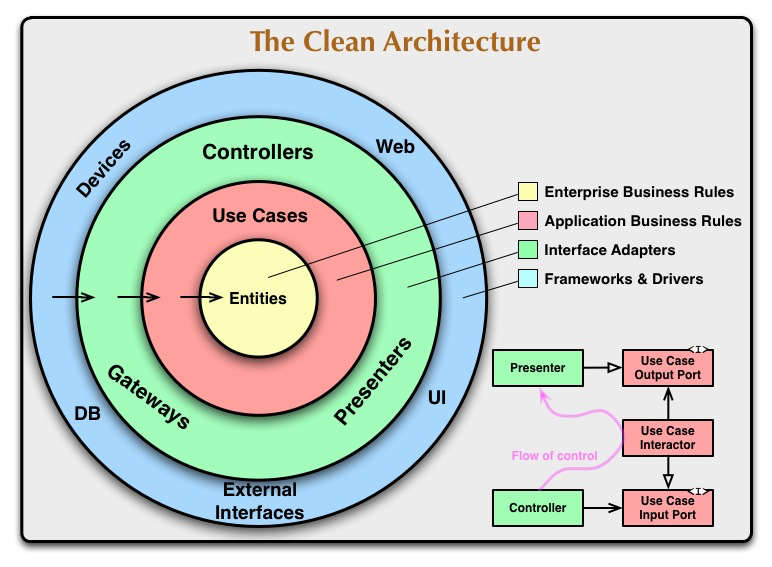

# EWA - Florijn

## General

Link to deployed application: https://florijn-team-2.up.railway.app/#/login

Link to UML system documentation: https://gitlab.fdmci.hva.nl/se-ewa/2022-2023-1/flo-2/-/wikis/Technical-documentation


Login data (all users have password: 'test'):

admin1@test.com (Admin)
admin2@test.com (Admin)

client1@test.com (Client) 
another 4 clients with the same email, but 1 number added

specialist1@test.com (Specialist) 
another 9 specialists with the same email, but 1 number added

## Frontend

### Getting started
to run the website, in the terminal and sure you are in the frontend folder and run `npm install`. Then run `npm run dev` and you should have the website running. 

### Vue 3
This project uses [Vue 3](https://vuejs.org) as Frontend Framework

### Vite
Vue has it's own way to start up a webserver to host your Vue website on `localhost`.
It works fine but we chose to use [Vite](https://vuejs.org), it's way faster, and has handy features.

### Styling

#### CSS
In this codebase there are two ways to style web pages. The first is using regular CSS. In the `src/styles.css` you will find the color from our design system.
You can use them like so: 
```
.container {
  background: var(--primary-500);
}
```
#### Tailwind CSS
In this project you can also use Tailwind CSS. Tailwind can be used right inline with your HTML. It is also integrated with our design system colors.

Quick example:
```
<div class="flex gap-8 items-center bg-primary-500 hover:bg-primary-700"></div>
```
We apply Flexbox with a gap and center the items horizontally, we give it the primary background color, when we hover we apply a darker shade as the background.  

---
## Backend

### Getting started
Use IntelliJ IDEA to start the backend application, it should run on http://localhost:8086.

### Architecture
The backend uses Clean Architecture. Like the original Clean Architecture idea from Uncle Bob our application uses 4 layers. 
Let's go through how our application uses these 4 layers.



#### Frameworks and Drivers
We will use the Spring framework in Java for creating the REST API. The database we will use is probably an H2 database.

#### Interface Adapters
- We use `Controller`'s for handling our REST requests, this will rely on the Spring framework
- We use `Repository`'s for (database) CRUD operations.
- We use `Presenter`'s for formatting the outgoing models to make them ready for the view.

#### Application Business Rules
`Interactor`'s will incorporate the application-specific business rules of the application.

#### Enterprise Business Rules
The application will have "domain" models. These models incorporate the highest level business rules, which are not application-specific.  


